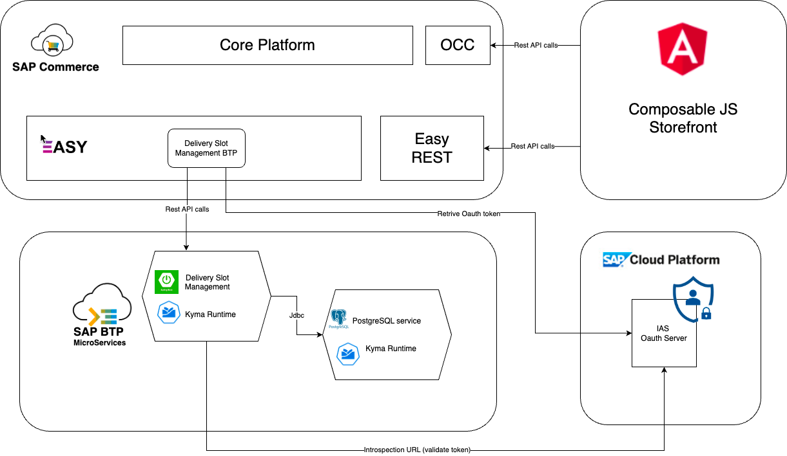
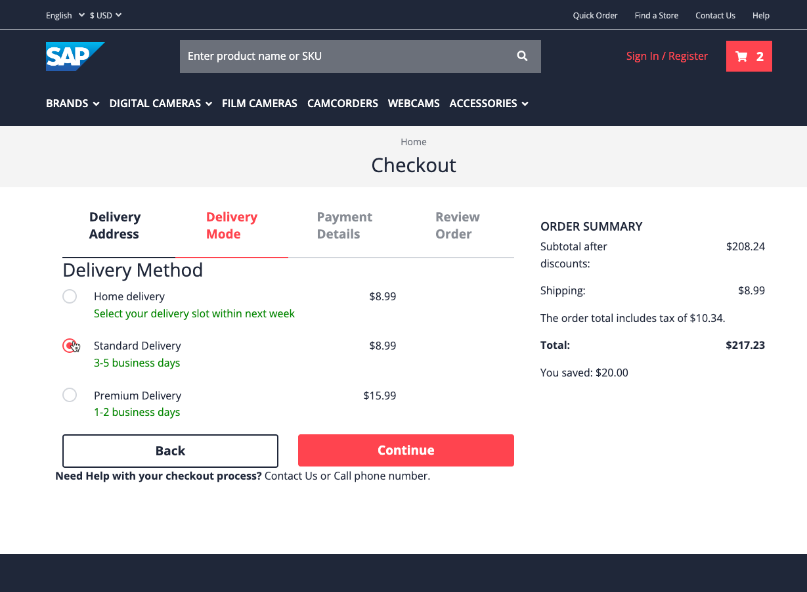
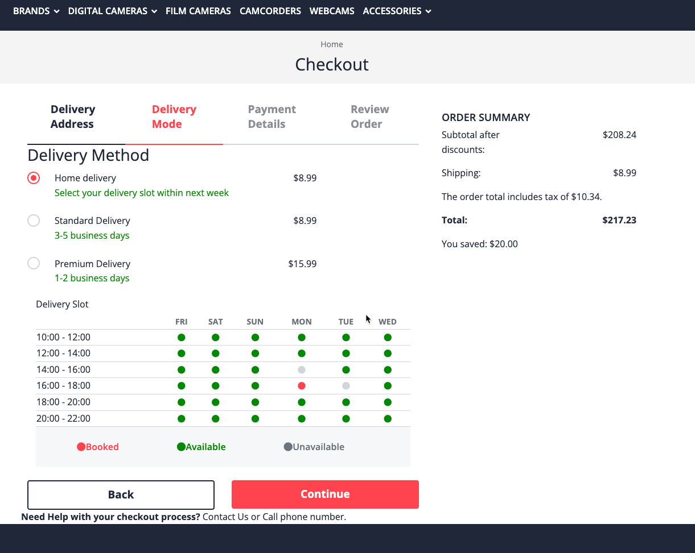
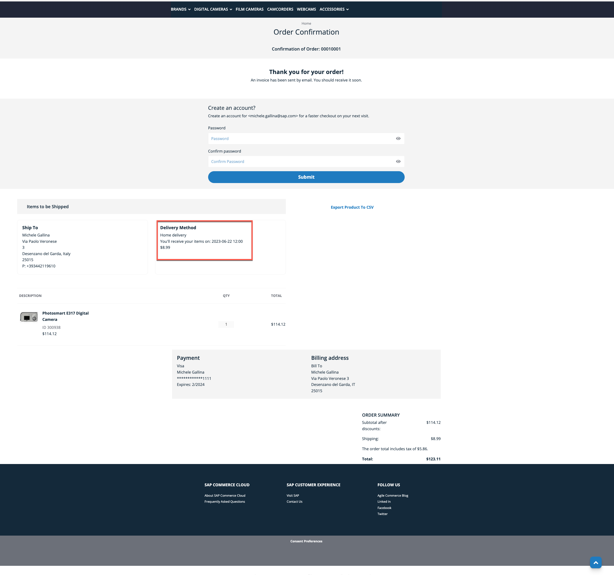
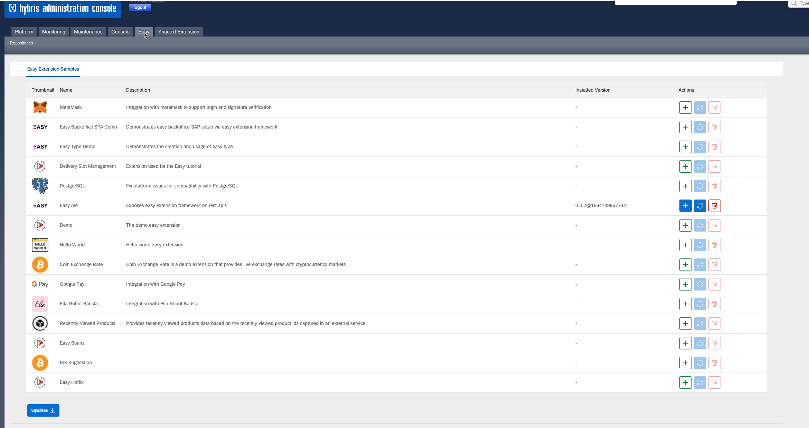
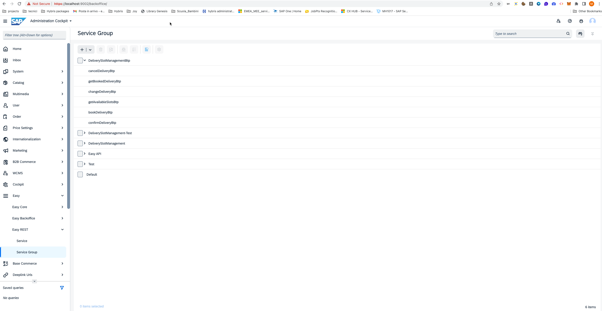
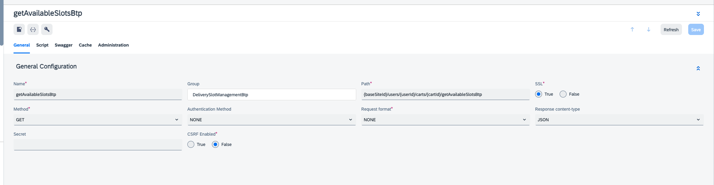
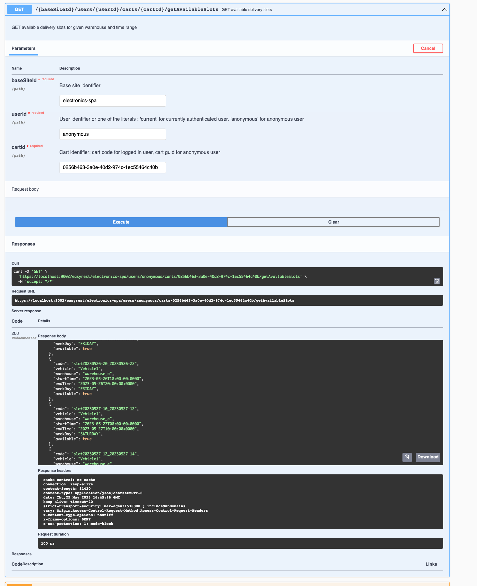

# Delivery Slot Management

## Overview
This extension is a sample demo to demonstrate the usage and capabilities of the Easy Extension Framework.
The demo is focused on the Home Delivery process where special kind of goods (like fresh food) are delivered directly at the home of the user who has ordered it through the ecommerce store.
The main difference with the standard shipping methods of ecommerce stores is that customer decides the specific time slot to receive his items based on the slots availability of the commerce store.
The main part of the business logic require to implement the above features have been developped on a Spring Boot java application that has been deployed as a Microservice in the Kyma runtime environment of a BTP subscription.
This Easy Extension represents the bridge between Commerce and the BTP Microservice and implement the server-to-server integration for each Endpoint.
We've kept the same url endpoints as the https://github.com/SAP-samples/easy-extension-samples/tree/main/delivery-slot-management extension, so obviously the 2 extensions can't be deployed at the same time on a Commerce installation.
With this solution however we don't need to implement any changes on the Spartacus module, since it will use the same endpoints for both easy extensions.
Here's a high level architecture of the solution:


## List of features
Let's first see the Business Entities that we need to model for the Home Delivery process:
- Warehouse: this entity generically represents physical stores where items are stocked and it will also be related to the slots availabilities (for instance some specific warehouse will have more then one vehicle and will have a higher availability for each time slot)
- Vehicle: this entity represents the mean of transport of items from physical stores/warehouses to customer home address. As we said, vehicle could have different characteristics and could be able to deliver only specific types of items. However, in our simplified implementation, vehicle will only be a placeorder for future developments but won't affect any business logic
- Delivery Slot: this entity holds the avaialbility details of a time slot that customer can book for a specific day, vehicle and warehouse. 
- Delivery Slot Management: this entity represents a customer booking for a specific slot. If the booking is still related to a cart, then its status will be BOOKED; once the order will be placed on the commerce shop and an order will be created, then also the associated booking will change its status to CONFIRMED.


Our extension has implemented the Home Delivery process of the checkout flow for the ecommerce site but it didn't implement anything of the OMS features required to manage the post order activities.
Let's now see more in detail the features that have been implemented.

### Home Delivery mode selection
During the checkout steps, after the customer has inserted his Address, there's the possibility to choose between different shipping modes. At this stage, the extension has created a specific "Home Delivery" shipping mode that is available after the extension installation for the electronics accelerator.



### Delivery Slot selection
After the ___home delivery___ mode has been selected, the customer will have to select a delivery slot within the next days to receive its goods.


The minimum and maximum lead time for the home delivery will be configurable through the following properties:
```
homeDelivery.minimumLeadTime=1
homeDelivery.maximumLeadTime=7
```
As you can see from the above picture, slots can be Available or Unavailable for customer to select: unavailable slots are those that have exhausted their availability quantity. 
So for instance if a delivery slot had 3 as available quantity and it has already 3 Delivery Slot Management (aka booking) associated (either in BOOKED or CONFIRMED status), then it would be returned as unavailable for a new customer executing the checkout flow.
If there are no available slots in between the minimum and maximum lead time an error will be presented to the customer and he'll have to choose a different delivery mode.
Till the order is not placed, customer can choose to change its delivery slot booking. Once the order will be placed, the delivery slot booking will be placed in CONFIRMED status.

### Booking cancellation (to be implemented)
A cronjob will run every few minutes in the BTP microservice application to retrieve delivery bookings older than a predefined amount of time configurable through properties (default of 30 minutes); if the booking is still in the BOOKED status it will be deleted to free the corresponding delivery slot for some other customer.

### Booking confirmed
Once the customer place an order with a ___Home Delivery___ shipping mode selected and a Delivery Slot Management (aka booking) associated, during the ___place order___ flow, the Delivery Sloot Management associated will be checked to see if it's still valid and present and then it will be changed to the CONFIRMED status.
In the Order Confirmation page, the ___Home Delivery___ square box will present the detail of the delivery to the customer


## Limitations
There are obviously a lot of complexities behind the management of a real Home Delivery process:
- you may have different vehicles with different capacity and characteristics (ex: size, cold/frozen)
- the order management system will have to calculate what vehicles can be used depending on the items composing the order and it will have to filter the delivery slot options
- you may have home delivery or pick up in store options
- you may have to deal with concurrency issues to ensure coherent management for slots availability when multiple customers try to book the same slot
- ....

Given this is a demo extension and not a production ready code, we have simplified significantly the process and only implemented few parts of it.

## How to Install
Here are the instructions to configure locally the extension and make it work. The extension has been developed to work with the standard `electronics-spa accelerator`, although it should easily work with other SAP accelerators as well with small changes.

### Install the BTP Kyma Microservice
Follow the instructions at [Delivery Slot Management Services on BTP](https://github.tools.sap/cx-boosters/easy-btp-delivery-slot-management/blob/main/deliveryslotmanagement-btp/README.md)

### Install SAP Commerce Platform

First thing is then to install the latest 2205 commerce version. Follow the official documentation:

- [Using the Installer Recipes](https://help.sap.com/docs/SAP_COMMERCE_CLOUD_PUBLIC_CLOUD/8be4e0379b294fbabf36d26e7ca4169d/cb3ff964e4784073a70f06165efbac8a.html?locale=en-US&version=v2205) to install using the cx recipe
- [Installing SAP Commerce Cloud Manually](https://help.sap.com/docs/SAP_COMMERCE_CLOUD_PUBLIC_CLOUD/8be4e0379b294fbabf36d26e7ca4169d/8bf5cfea86691014a00e9705a3c84074.html?locale=en-US&version=v2205) to install manually if you know the required extensions to set up the electronics or apparel-uk accelerator

### Install the Easy Framework
Install `Easy Extension Framework` as explained in the [documentation](https://sap.github.io/easy-extension-framework/install-for-existing-setup.html).

### Configure Local Easy repository
Next you'll have to configure the Git repository where the tutorial extension is stored. If you want to play around locally with the extension we suggest you to create a local easy repository that will simplify and speed up your development.
Follow these [steps](https://sap.github.io/easy-extension-framework/configuring-an-easy-repository-in-backoffice/):
- Clone locally the [Easy Extension Sample](https://github.tools.sap/cx-boosters/easy-extension-samples/tree/easy-0.2) repository (branch compatible to the installed Easy Extension Framework version. For example: The compatible branch for `v0.x` of Easy Extension Framework is `easy-0.x`).
- Configure it as the Local Repository as explained in the [documentation](https://sap.github.io/easy-extension-framework/configuring-an-easy-repository-in-backoffice.html#configuring-a-local-repository).

### Install Delivery Slot Management Btp Easy extension
Easy extensions have to be installed through the Administration Console:
- Connect to the hac and log in
- If you've correctly created your Easy local repository, you should see under the Easy tab, the repository with the list of easy extensions retrieved:

- Click the "Update" button to be sure you've the latest version of your local repository: the update button will refresh the copy of the repositories that is stored in the _data_ dir of Commerce
- Click on the "+" button next to the "Delivery Slot Management Btp" extension and wait the installation procedure is completed: if there are no errors you should see a successful blue message banner in the hac, if something went wrong during installation, a red message banner will pop up in the hac. In this case you'll have to check the server log to see what is the problem
- We suggest you to repeat the last step also for the "Easy Api" extension that will give you access to a Swagger endpoint so that you can easily test the endpoints of the tutorial extension 

## How to test
There are different ways you can test the extension:
- you can use the Spock framework and define Unit test for your backend services, classes
- you can still use Spock together with a Rest library to test your API rest endpoints
- you can leverage the Swagger framework to test your endpoints

### Test using Spock and Gradle
The extension provides a couple of tests that have been prepared using the Spock framework:
- A unit test for the DeliverySlotService backend service
- A rest test for one of the Easy Rest endpoint defined by the extension

To make them work, simply run _gradle test_ from the root of the project, youl'll see also a generated report under the _build/reports_ folder

### Test using Swagger
Here's how you can test your endpoints levaraging Swagger:
1. Connect to the _backoffice_ application
2. Click on the Easy -> Easy Rest -> Service Group node on the navigation tree

3. On the main panel you should see the DeliverySlotManagement group and under it, 6 services. Click on the one you want to test
4. In the editor area of the selected rest service, click on the _Go to Swagger_ icon

5. On the Swagger page, select the endpoint you want to test, click _Try it out_ and fill the required parameters


## Setup Spartacus library
The one described above is the procedure to set up the easy extension on your local environment. Then to complete the integration with your Spartacus frontend (remember to make it work you should use Spartacus libraries 5.2 that are compatible with Commerce 2205), you'll have two options:
- you can use the published library following the istructions: [Use the library](https://github.tools.sap/cx-boosters/easy-extension-samples-spa#use-the-library). The name of the library is _delivery-slot-management_ and _DeliverySlotManagementModule_ is the name of the angular module. You first need to setup access to the Jfrog repository where libraries are hosted following the instructions here: [Repository Setup](https://github.tools.sap/cx-boosters/easy-extension-samples-spa#repository-setup)
- if you want to see the source code of the spartacus library, then simply replace your spartacus project with the one of the https://github.tools.sap/cx-boosters/easy-extension-samples-spa repository
