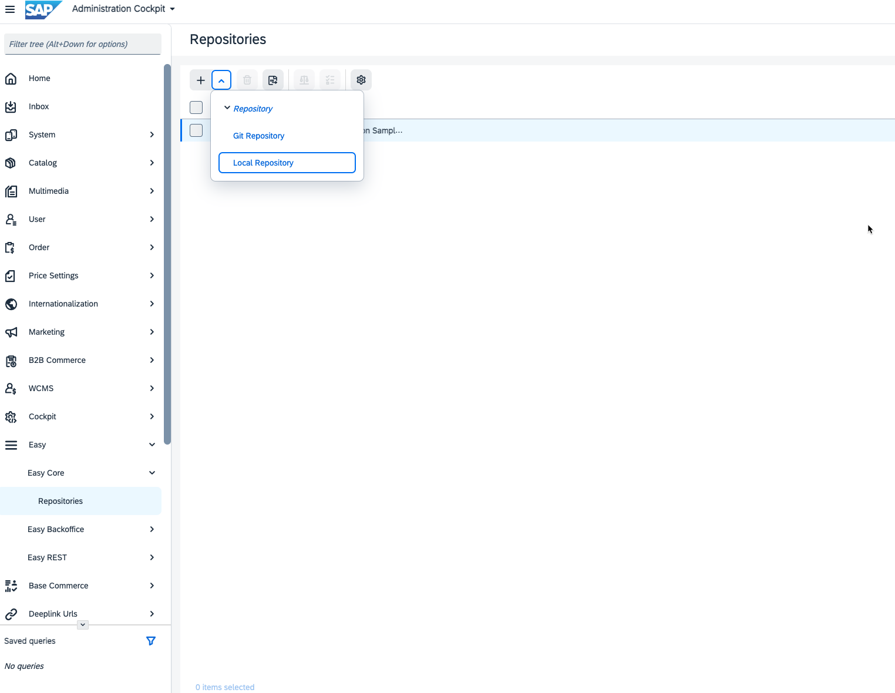
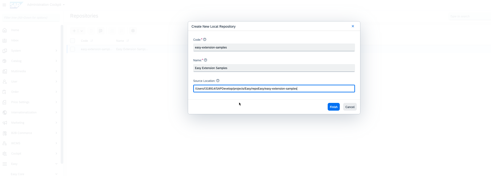
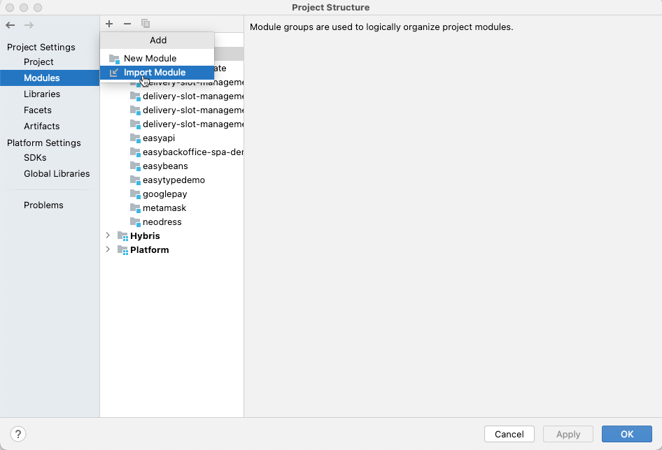
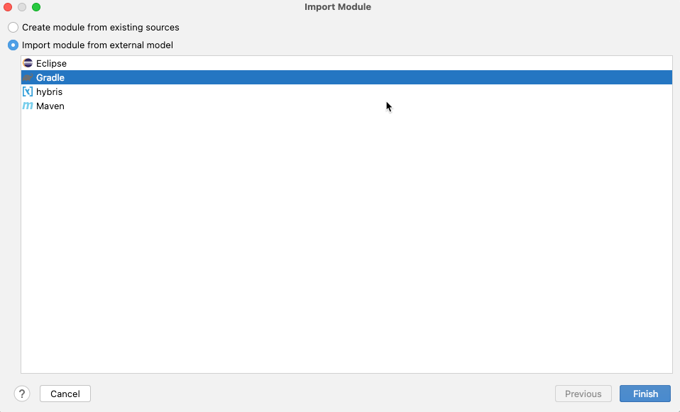
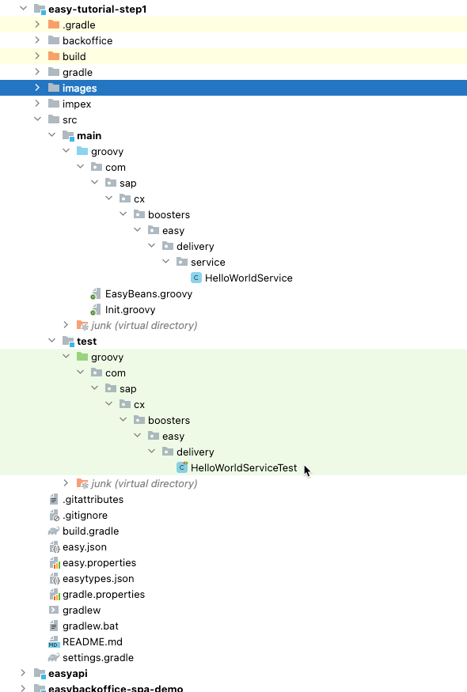

# Easy Extension Framework Tutorial

In this tutorial, we will build a new extension to add new features that do not exist in SAP Commerce Cloud out-of-the-box. As an exercise, we will create an extension to manage delivery slots.

To understand what we will build during this tutorial, you can check the final outcome: [delivery-slot-management](https://github.tools.sap/cx-boosters/easy-extension-samples/tree/main/delivery-slot-management/README.md) extension. You will find in the documentation the list of features.

In this tutorial, you will learn:
- [How to setup your development environment](#easy-tutorial-step-1---setup-your-development-environment)
- [How to extend SAP Commerce data model](../easy-tutorial-step2)
- [How to create and override Spring Beans](../easy-tutorial-step3)
- [How to create new REST endpoints](../easy-tutorial-step4)
- [How to create the Backoffice configuration](../easy-tutorial-step5)
- [How to integrate with SAP Commerce Cloud Composable storefront (aka Spartacus)](../easy-tutorial-step6)

# Easy Tutorial Step 1 - Setup your Development Environment 

## Overview
In this step of the tutorial, you will learn how to setup Easy Extension Framework, install a new extension and setup your IDE.

## Setup
Here are the instructions to configure locally the extension and make it works. The extension has been developed to work with the standard electronics-spa accelerator, although it can work easily with other spa accelerators as well with small changes.

### Install SAP Commerce Platform

First thing is then to install the latest 2205 commerce version. Follow the official documentation:

- [Using the Installer Recipes](https://help.sap.com/docs/SAP_COMMERCE_CLOUD_PUBLIC_CLOUD/8be4e0379b294fbabf36d26e7ca4169d/cb3ff964e4784073a70f06165efbac8a.html?locale=en-US&version=v2205) to install using the cx recipe
- [Installing SAP Commerce Cloud Manually](https://help.sap.com/docs/SAP_COMMERCE_CLOUD_PUBLIC_CLOUD/8be4e0379b294fbabf36d26e7ca4169d/8bf5cfea86691014a00e9705a3c84074.html?locale=en-US&version=v2205) to install manually if you know the required extensions to set up the electronics or apparel-uk accelerator

### Install the Easy Framework
1. Download [Easy Extension Framework](https://github.com/SAP/easy-extension-framework)
2. Add Easy extensions to your **localextensions.xml** file:
```
<extension dir="easycore" />
<extension dir="easytype" />    
<extension dir="easybackoffice" />    
<extension dir="easyrest" />
```
3. Run `ant clean all`
4. Run `ant initialize -Dtenant=master`
5. Start SAP Commerce Cloud server with `<HYBRIS_HOME>/bin/platform/hybrisserver.sh`

### Configure local Easy repository
Next you'll have to configure the Git repository where the tutorial extension is stored. If you want to play around locally with the extension we suggest you to create a local easy repository that will simplify and speed up your development.
Follow these steps:
- clone locally the [Easy Extension Sample](https://github.tools.sap/cx-boosters/easy-extension-samples/tree/easy-0.2) repository (branch easy-0.2)
- Login into the backoffice and find the Easy node on the Navigation Tree, open Easy Core, Repositories and click on the + button to create a new "local repository"

- populate the wizard giving the repo a code, name and the path of your local File System where you've cloned the remote easy-extension-samples repo


### Install Easy Tutorial Step 1 extension
Easy extensions have to be installed through the Administration Console:
- Connect to the hac and log in
- If you've correctly created your Easy local repository, you should see under the Easy tab, the repository with the list of easy extensions retrieved:

- Click the "Update" button to be sure you've the latest version of your local repository: the update button will refresh the copy of the repositories that is stored in the _data_ dir of Commerce
- Click on the "+" button next to the "Easy Tutorial Step 1" extension and wait the installation procedure is completed: if there are no errors you should see a successful blue message banner in the hac, if something went wrong during installation, a red message banner will pop up in the hac. In this case you'll have to check the server log to see what is the problem
- We suggest you to repeat the last step also for the "Easy Api" extension that will give you access to a Swagger endpoint so that you can easily test the endpoints of the tutorial extension

### Set up the extension locally on your IDE

To set up the **easy-tutorial-step1** extension in your local IDE you need to:
1. add a file _gradle.properties_ to the root of the extension.
```
easyRepoDir=/Users/I318914/SAPDevelop/projects/Easy/repoEasy/easy-extension-samples/easy-tutorial-step1
easyDeployUrl=http://localhost:9001/easyrest/easy/deploy
systemProp.org.ajoberstar.grgit.auth.username=<my git username>
systemProp.org.ajoberstar.grgit.auth.password=<my personal git token>
groovyHacHybrisHomeDir=/Users/I318914/SAPDevelop/projects/Easy/CXCOMCL221100P_5-70007431/hybris
```
The first four properties are needed if you want to use gradle and the grgit plugin to deploy your extension locally (it's not really needed, you can simply adopt the procedure we've described above)
The last groovyHacHybrisHomeDir property must point to the local installation of your Commerce platform and will be used to set up all dependencies 
from the platform extensions so that your easy extension can be imported in the IDE without issues.
Here's how you can set up IntelliJ IDEA with the extension. First import your Commerce project into IDEA.
2. import your Commerce project into IDEA
3. import a new module from existing sources following these steps:
   1. click on File -> Project Structure -> Module -> + -> Import Module
      
   2. in the wizard, select the root folder of the easy-tutorial-step1 extension and then select _Import module from external_ and select _Gradle_ option
   
   3. Click _Finish_ to complete the import process. You should be able to correctly see the imported easy extension
   

That's it! You should now be able to develop with your IDE and also when needed you can start the Remote debugging and debug the groovy code of easy extension that you installed. 

## Your mission
Your only task for this step of the tutorial is to follow the above instructions for the setup of your local environment. Once completed, you can execute the sample unite test, simply running _gradle test_ from the root of the project and you should see also a generated report under the _build/reports_ folder.

## Next step
Once completed, simply uninstall this **Easy Tutorial Step 1** extension and install the next one: [Easy Tutorial Step 2](../easy-tutorial-step2/README.md) extension.
