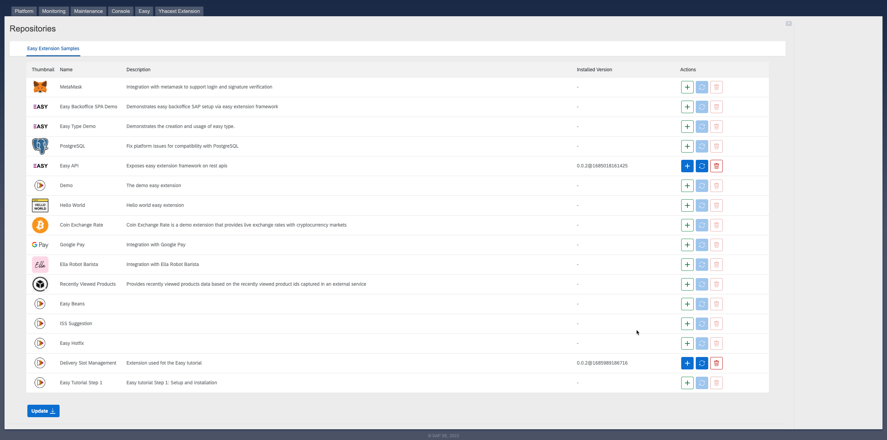

# Easy Extension Framework Tutorial

In this tutorial, we will build a new extension to add new features that do not exist in SAP Commerce Cloud out-of-the-box. As an exercise, we will create an extension to manage delivery slots.

To understand what we will build during this tutorial, you can check the final outcome: [delivery-slot-management](https://github.tools.sap/cx-boosters/easy-extension-samples/tree/main/delivery-slot-management/README.md) extension. You will find in the documentation the list of features.

In this tutorial, you will learn:
- How to setup your development environment
- [How to extend SAP Commerce data model](../easy-tutorial-step2)
- [How to create and override Spring Beans](../easy-tutorial-step3)
- [How to create new REST endpoints](../easy-tutorial-step4)
- [How to create the Backoffice configuration](../easy-tutorial-step5)
- [How to integrate with SAP Commerce Cloud Composable storefront (aka Spartacus)](../easy-tutorial-step6)

# Easy Tutorial Step 1 - Setup your Development Environment 

## Overview
In this step of the tutorial, you will learn how to setup Easy Extension Framework, install a new extension and set up your IDE.

## Setup
Here are the instructions to configure locally the extension and make it works. The extension has been developed to work with the standard electronics-spa accelerator, although it can work easily with other spa accelerators as well with small changes.

[Here](https://sap.github.io/easy-extension-framework/getting-started/) you can find more details on the installation procedure.

### Install SAP Commerce Platform

First thing is then to install the latest 2205 commerce version. Follow the official documentation:

- [Using the Installer Recipes](https://help.sap.com/docs/SAP_COMMERCE_CLOUD_PUBLIC_CLOUD/8be4e0379b294fbabf36d26e7ca4169d/cb3ff964e4784073a70f06165efbac8a.html?locale=en-US&version=v2205) to install using the cx recipe
- [Installing SAP Commerce Cloud Manually](https://help.sap.com/docs/SAP_COMMERCE_CLOUD_PUBLIC_CLOUD/8be4e0379b294fbabf36d26e7ca4169d/8bf5cfea86691014a00e9705a3c84074.html?locale=en-US&version=v2205) to install manually if you know the required extensions to set up the electronics or apparel-uk accelerator

### Install the Easy Framework
Install `Easy Extension Framework` as explained in the [documentation](https://sap.github.io/easy-extension-framework/install-for-existing-setup.html).

### Configure Local Easy repository
Next you'll have to configure the Git repository where the tutorial extension is stored. If you want to play around locally with the extension we suggest you to create a local easy repository that will simplify and speed up your development.
Follow these [steps](https://sap.github.io/easy-extension-framework/configuring-an-easy-repository-in-backoffice/):
- Clone locally the [Easy Extension Sample](https://github.tools.sap/cx-boosters/easy-extension-samples/tree/easy-0.2) repository (branch compatible to the installed Easy Extension Framework version. For example: The compatible branch for `v0.x` of Easy Extension Framework is `easy-0.x`). 
- Configure it as the Local Repository as explained in the [documentation](https://sap.github.io/easy-extension-framework/configuring-an-easy-repository-in-backoffice.html#configuring-a-local-repository).

### Configure Easy Extension Development Environment
The easy extensions development environment setup is based on [Gradle](https://gradle.org/). Following are the steps to setup the environment:
1. Install [Gradle](https://gradle.org/) as per the instructions available at [Gradle Installation](https://gradle.org/install/)
2. Configure the following global gradle configurations for your environment in `<USER_HOME>/.gradle/gradle.properties` file:
   ```properties
   # The base url of the easy api for your SAP Commerce Cloud. Below if for a local SAP Commerce Cloud Server
   sap.commerce.easy.api.base.url = https://localhost:9002/easyrest/easyapi

   # Value of easy.apiKey property configured in SAP Commerce Cloud (by default, this is 123456)
   sap.commerce.easy.api.key = 123456

   # Path to the hybris home directory on your computer to add SAP Commerce Cloud libraries to your extension
   sap.commerce.easy.platform.home= <PATH TO YOUR HYBRIS PLATFORM DIRECTORY>
   sap.commerce.easy.rest.base.url = https://localhost:9002/easyrest
   ```
   
### Set up the extension locally on your IDE

To set up the **easy-tutorial-step1** extension in your local IDE you need to:
1. Execute the following command in the repository directory
   ```gradle
   gradle clean build
   ```
2. import the repository directory project into IDEA by clicking on File &rarr; Open &rarr; Select the easy directory

That's it! You should now be able to develop with your IDE and also when needed you can start the Remote debugging and debug the groovy code of easy extension that you installed. 

### Install Easy Tutorial Step 1 extension
Easy extensions can be installed either through the Administration Console, using swagger console or using gradle command:
#### Installing using SAP Commerce Administration Console
- Connect to the SAP Commerce Administration Console and log in
- If you've correctly created your Easy local repository, you should see under the Easy tab, the repository with the list of easy extensions retrieved:
  
- Click the "Update" button to be sure you've the latest version of your local repository: the update button will refresh the copy of the repositories that is stored in the _data_ dir of Commerce
- Click on the <button style="padding: 10px; background-color: #0066cc; color: white; border: none; border-radius: 4px; cursor: pointer;">&nbsp;+&nbsp;</button> button next to the "Easy Tutorial Step 1" extension and wait the installation procedure is completed: if there are no errors you should see a successful blue message banner in the hac, if something went wrong during installation, a red message banner will pop up in the hac. In this case you'll have to check the server log to see what is the problem

> **Note:** We recommend you to repeat the last step also for the **Easy Api** extension by clicking on the <button style="padding: 10px; background-color: #0066cc; color: white; border: none; border-radius: 4px; cursor: pointer;">&nbsp;+&nbsp;</button> button against the **Easy Api** extension. This will give you access to a Swagger endpoint so that you can easily test the endpoints of the tutorial extension and use gradle commandline for easy extension development

#### Installing using Swagger Console

#### Installing using Gradle Commandline 
- Validate/Configure your repository configurations for gradle by ensuring that the repository code configured in backoffice matches the following property in `gradle.propertes` available at the root of your locally checked out repository:
  ```properties
  sap.commerce.easy.repository.code = <THE REPOSITORY CODE YOU CONFIGURED IN BACKOFFICE>
  ```
- Run the gradle task `easy-update-repo` either from your IDE or from commandline to update the latest from the remote repository location
  ```
  > Task :easy-update-repo
  API executed successfully. HTTP status: 200
  {
  "eventId": "00000001",
  "message": "Update request for repository easy-sample-repo submitted"
  }
  
  BUILD SUCCESSFUL in 3s
  1 actionable task: 1 executed
  ```
- Run the gradle task `easy-ext-install` for your extension either from your IDE or from commandline inside the extension directory to install the easy extension

## Your mission
Your only task for this step of the tutorial is to follow the above instructions for the setup of your local environment. Once completed, you can execute the sample unite test, simply running _gradle test_ from the root of the project and you should see also a generated report under the _build/reports_ folder.

## Next step
Once completed, simply uninstall this **Easy Tutorial Step 1** extension and install the next one: [Easy Tutorial Step 2](../easy-tutorial-step2/README.md) extension.
