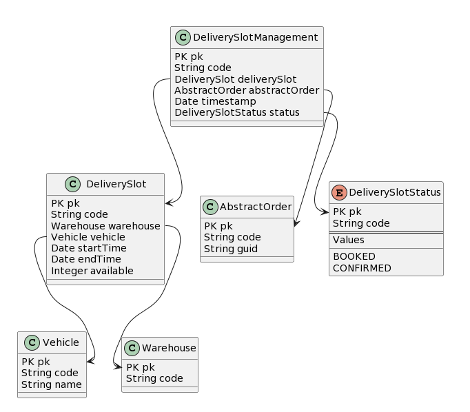

# Easy Tutorial Step 2

## Overview
This step of the tutorial will show you how you can define your custom data model in an Easy extension,  how you can create your model classes for the new itemtypes and finally how you can set up data through impex loaded during the installation process.

## Home Delivery Data Model
Here's the data model that you need to implement for the extension:



with 3 new itemtypes:
- Vehicle
- DeliverySlot
- DeliverySlotManagement

and a new Enumeration:
- DeliverySlotStatus

## Creating new itemtypes
Modelling new itemtypes in an Easy extension is a process that requires 2 steps:
- creating the easytypes.json file
- creating the model classes for the new itemtypes

### Easytypes.json
This file is roughly the equivalent of stamdard items.xml files where the datamodel of traditional Commerce extensions is defined. The structure of the file, attribute names, etc. everything mirrors the same components in the items.xml files.
Let's see an extract of the file:
```
"itemtypes": [
    {
      "code": "Vehicle",
      "name": [
        {
          "lang": "en",
          "value": "Vehicle"
        }
      ],
      "autocreate": "true",
      "generate": "true",
      "superType": "GenericItem",
      "deployment": {
        "table": "vehicles",
        "typecode": "26000",
        "propstable": "vehicleprops"
      },
      "attributes": [
        {
          "qualifier": "code",
          "type": "java.lang.String",
          "name": [
            {
              "lang": "en",
              "value": "Code"
            }
          ],
          "persistence": {
            "type": "property",
            "column": "p_code"
          },
          "modifiers": {
            "unique": "true",
            "initial": "true",
            "optional": "false",
            "write": "false",
            "partof": "false"
          }
        },
        {
          "qualifier": "name",
          "type": "localized:java.lang.String",
          "name": [
            {
              "lang": "en",
              "value": "Name"
            }
          ],
          "persistence": {
            "type": "property",
            "column": "p_name"
          },
          "modifiers": {
            "unique": "false",
            "initial": "false",
            "optional": "true",
            "write": "true",
            "partof": "false"
          }
        }
      ]
    },
```

### Create the model classes
This second step is required if you want to use your own model class for the newly created itemtypes. In the traditional Commerce extensions, model classes are generated by the build process directly from the items.xml structure.
For Easy extensions, the process is still manual, so you've to create the groovy model class for the itemtype and then you need to register it on the properties file of the extension
Here are the properties that you need to set up:
```
easyextension.EasyTutorialStep2.easy.type.base.models.package=com.sap.cx.boosters.easy.delivery.easytype
easytype.Vehicle.modelClass=com.sap.cx.boosters.easy.delivery.easytype.model.VehicleModel
easytype.DeliverySlot.modelClass=com.sap.cx.boosters.easy.delivery.easytype.model.DeliverySlotModel
easytype.DeliverySlotStatus.modelClass=com.sap.cx.boosters.easy.delivery.easytype.enums.DeliverySlotStatus
```
## Importing data on Easy Extension
Let's see how you can import data into Easy Extension.
During the installation process, each easy extension can load data through impex files that are stored under the `impex/install` folder.
If you want to revert the loading of data during the uninstallation process, you can store impex files for removal under the `impex/uninstall` folder.

## Tutorial tasks
These are your tasks to complete this tutorial step:
- complete the creation of the data model with the missing itemtypes
- create also the model classes for the new itemtypes
- create impex files to load delivery slots for the next 2 weeks. Create for every day of the week a slot for each of this time windows:
  - 10:00 to 12:00
  - 12:00 to 14:00
  - 14:00 to 16:00
  - 16:00 to 18:00
  - 18:00 to 20:00
  - 20:00 to 22:00
- create impex to remove delivery slots created above during uninstall process

## Next Step
Once completed, simply uninstall this Easy Tutorial Step 2 extension and install the next one: Easy Tutorial Step 3 extension. In this next tutorial step you'll find also the solution to your task and you can compare it with yours.