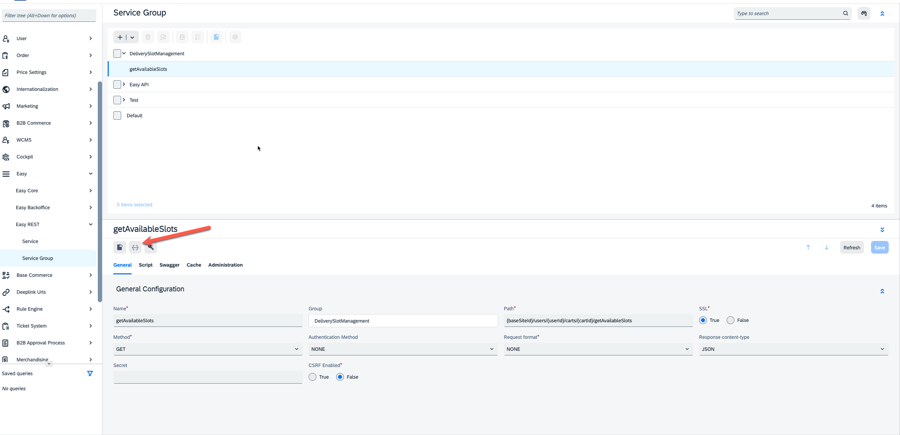

# Easy Tutorial Step 4 - Create New REST API

## Overview
In this step of the tutorial, you will how to create your REST endpoints, the controller associated to the endpoint, how to register them on the Spring Web Context and how you can test them.

## Create the Controller
Take as an example the `AvailableSlotsController` that is provided with the extension. As you can see the controller must implement the `EasyRestServiceController` interface.
It can retrieve all parameters (path params, query params, form params, etc. ) from the context `Map` that is passed as parameter in the `execute` method. 

## Register the Controller
Controllers must then be registered in the Spring web context of `/easyrest` web application using the `EasyBeans.groovy` script.
```
easyWebBeans('/easyrest') {
	logger.info "[${extension.id}] registering [/easyrest] Spring beans ..."

	availableSlotsController(AvailableSlotsController)

	logger.info "[${extension.id}] registered Spring core beans ..."
}
```
As you can see, also the required dependencies are injected into the controller using the script.

## Create the REST endpoint
You then need to create the Easy Rest Endpoint into the system. You can do it through the Backoffice and export into ImpEx to add to your extension so this loaded during the installation process.
```
INSERT_UPDATE EasyRestGroup; Name[unique = true]
                           ; DeliverySlotManagement

INSERT_UPDATE EasyRest; name[unique = true]; easyRestGroup(name)    ; path[unique = true]                      ; ssl  ; method(code); authenticationMethod(code); format(code); contentType(code); springBean               ; script; swaggerSummary                 ; swaggerDescription                                                ; swaggerParameters[allownull = true]; swaggerRequestBody[allownull = true]; swaggerResponses[allownull = true]; csrf;
                      ; getAvailableSlots  ; DeliverySlotManagement ; {baseSiteId}/users/{userId}/carts/{cartId}/getAvailableSlots ; true ; GET         ; NONE                      ; NONE        ; JSON             ; availableSlotsController ;       ; "GET available delivery slots" ; "GET available delivery slots for given warehouse and time range" ;"
[
  {
    ""in"": ""path"",
    ""name"": ""baseSiteId"",
    ""description"": ""Base site identifier"",
    ""required"": true,
    ""type"": ""string""
  },
  {
    ""in"": ""path"",
    ""name"": ""userId"",
    ""description"": ""User identifier or one of the literals : 'current' for currently authenticated user, 'anonymous' for anonymous user"",
    ""required"": true,
    ""type"": ""string""
  },
  {
    ""in"": ""path"",
    ""name"": ""cartId"",
    ""description"": ""Cart identifier: cart code for logged in user, cart guid for anonymous user"",
    ""required"": true,
    ""type"": ""string""
  }
]
"; ; ; false
```

As you can see, you can specify all the details of the endpoint on the `EasyRest` itemtype.

## Create the test classes for the REST Endpoint
You can test the REST endpoint using the Swagger interface if you've installed the `Easy API` extension.
To do this click on the three dots icon that you'll find under the Easy Rest itemtype

You can also write your own groovy test class that will call the REST Endpoint.
To prepare some sample test data, you can leverage again the impex loading process during installation.

## Your mission
These are your tasks to complete this tutorial step:
- Create the REST endpoints for the following actions:

|    Rest Service    | Http method |                                     Path                                     | Parameters                                                                                            | Response                                                                                 | Errors                                                                          | Notes                                                                                                                                                                                                                                                                                                   |
|:------------------:|:-----------:|:----------------------------------------------------------------------------:|-------------------------------------------------------------------------------------------------------|------------------------------------------------------------------------------------------|---------------------------------------------------------------------------------|---------------------------------------------------------------------------------------------------------------------------------------------------------------------------------------------------------------------------------------------------------------------------------------------------------|
|  Book reservation  |    POST     |   {baseSiteId}/users/{userId}/carts/{cartId}/slotsManagement/bookDelivery    | Path parameters:<br>- siteId<br>- userId<br>- cartId<br>Query parameters:<br>- Delivery Slot code     | Json response with the detail of the newly created DeliverySlotManagement item           | If the passed deliveryslot is no more available a 500 error will be returned    | CartId will follow same rules of standard accelerator for users: will be the guid of the Cart for anonymous users, the Cart code for authenticated users.The DeliverySlotManagement row created will have the cart field populated and the order empty, status will be BOOKED                           |
|  Get Reservation   |     GET     | {baseSiteId}/users/{userId}/carts/{cartId}/slotsManagement/getBookedDelivery | Path parameters:<br>- siteId<br>- userId<br>- cartId<br>                                              | Json response with the detail of the booked deliveryslotmanagement associate to the cart | 404 error status if no there's no deliveryslotmanagement associated to the cart | We assume that there can only be 1 deliverySlotManagement associated to a cart.                                                                                                                                                                                                                         |
| Change reservation |     PUT     |  {baseSiteId}/users/{userId}/carts/{cartId}/slotsManagement/changeDelivery   | Path parameters:<br>- siteId<br>- userId<br>- cartId<br>Query parameters:<br>- New Delivery Slot code | Json response with the detail of the updated DeliverySlotManagement item                 | 500 error status if the operation couldn't be completed                         | This operation is used when a customer change the delivery slot previously booked.<br>The service retrieves the deliverySlotManagement associated to the passed cart and if it exists and is still in the BOOKED status and if the passed delivery slot is still available, then it performs the update |


- Create test cases for each implemented controllers

## Next step
Once completed, simply uninstall this Easy Tutorial Step 4 extension and install the next one: [Easy Tutorial Step 5](../easy-tutorial-step5/README.md) extension. In this next tutorial step you'll find also the solution to your task and you can compare it with yours.
